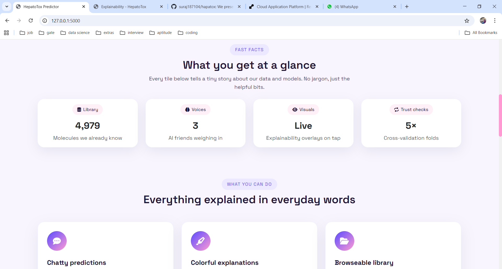
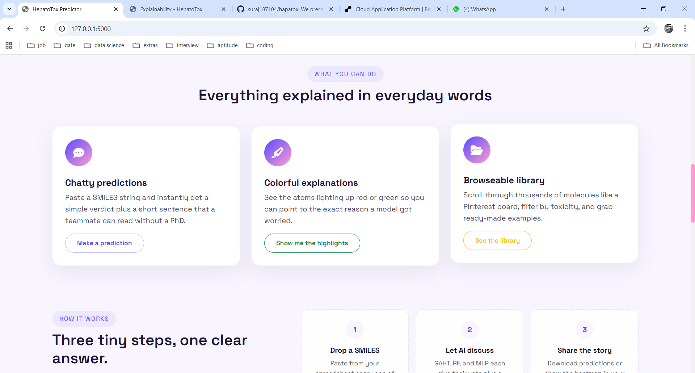
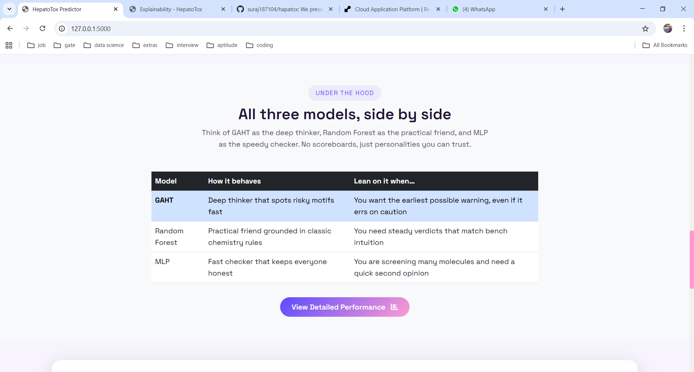
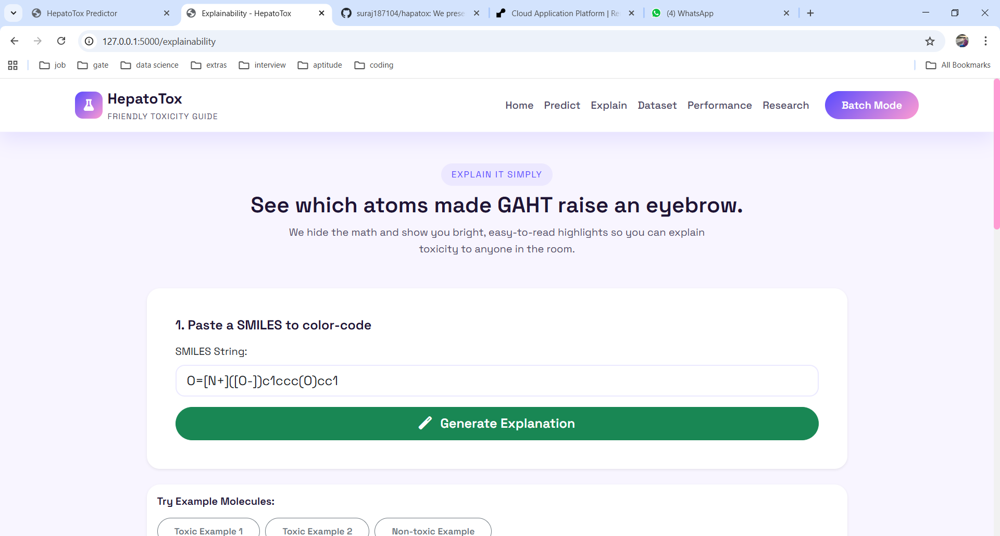
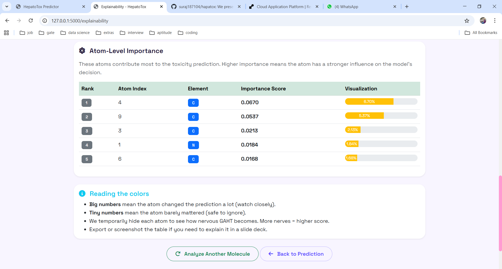
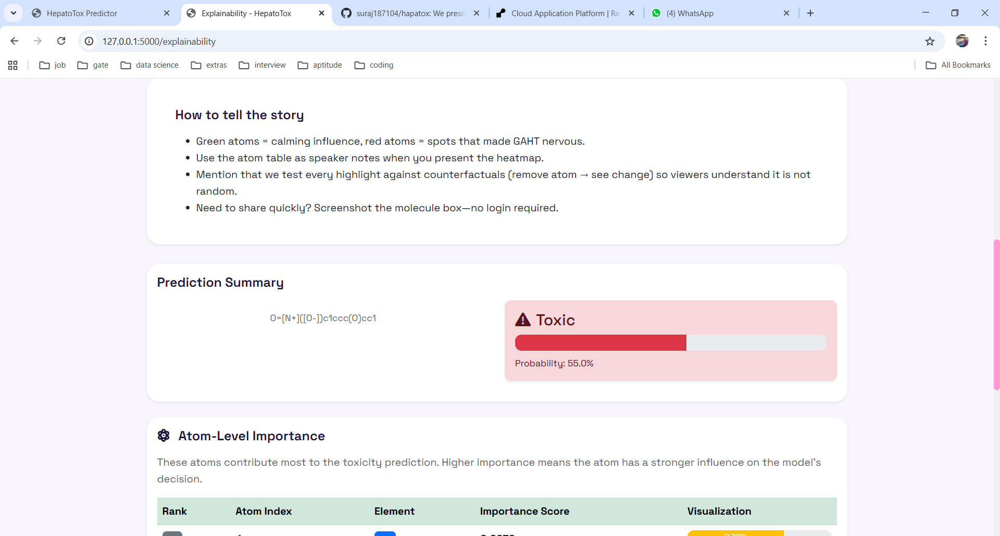
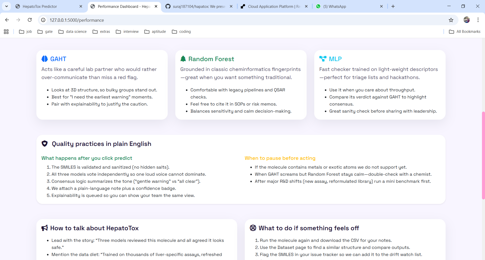

# 🧬 HepatoTox: Friendly Hepatotoxicity Prediction

<div align="center">



**AI-powered liver toxicity predictions made simple for everyone**

[](https://www.python.org/downloads/)
[](https://flask.palletsprojects.com/)
[](https://opensource.org/licenses/MIT)

[Live Demo](https://hapatox.onrender.com/) • [Research Paper](#) • [Documentation](#getting-started)

</div>

---
##live demo https://hapatox.onrender.com/

## 📖 What is HepatoTox?

HepatoTox turns complex hepatotoxicity (liver damage) predictions into **bright, plain-language insights** anyone can understand. Paste a SMILES string, upload a CSV, or browse our molecule library—then watch three AI models team up to give you a simple verdict plus color-coded explanations.

Built on peer-reviewed research featuring **GAHT** (Geo-Aware Hybrid Transformer), Random Forest, and MLP models trained on 4,979 molecules from Tox21 assays.

### ✨ Key Features

- 🎯 **One-Click Predictions** – Paste SMILES, get toxicity verdict in under a minute
- 🎨 **Colorful Explanations** – See red/green atom highlights showing exactly why a model flagged risk
- 📚 **Browseable Library** – Filter 4,979+ molecules like a Pinterest board
- 📊 **Batch Upload** – Process up to 100 molecules from CSV and download friendly reports
- 🔬 **No Jargon Mode** – All pages written for non-technical teammates
- 🚀 **Always Free** – No login, no tracking, just predictions

---

## 🖼️ Screenshots

### Home Page – Friendly Hero & Stats

*Plain-language metrics and a warm welcome replacing intimidating accuracy tables.*

### Single Prediction – Instant Feedback

*Drop in a SMILES, choose an example, and see all three models vote with confidence badges.*

### Explainability – Color-Coded Atoms

*Red atoms = risky motifs, green atoms = calming influence. Perfect for screen sharing.*

### Dataset Gallery – Visual Molecule Cards

*Filter by toxicity, click "Predict," or bookmark favorites for later.*

### Trust Playbook – No Raw Metrics

*Instead of AUROC tables, we explain model personalities and QA routines in everyday words.*

### Research Story – Academic Origins

*Highlights from the GAHT paper without requiring a PhD to follow along.*

### Batch Mode – Spreadsheet Lovers Welcome

*Upload CSV, download friendly report—great for Friday backlog clears.*

---

## 🚀 Getting Started

### Prerequisites

- Python 3.8+
- pip package manager
- 4GB+ RAM recommended (for model loading)

### Quick Installation

```bash
# Clone the repository
git clone https://github.com/yourusername/hepatotox-predictor.git
cd hepatotox-predictor

# Install dependencies
pip install -r requirements.txt

# Run the application
python app.py
```

Visit `http://127.0.0.1:5000` in your browser.

### Project Structure

```
web/
├── app.py                   # Flask application entry point
├── config.py               # Paths, model settings
├── requirements.txt        # Python dependencies
│
├── models/                 # Model loading & prediction
│   ├── gaht_model.py      # GAHT PyTorch architecture
│   ├── model_loader.py    # Load trained models
│   └── predictor.py       # Unified prediction pipeline
│
├── utils/                  # Chemistry & visualization helpers
│   ├── molecule_utils.py  # SMILES validation, RDKit
│   ├── feature_extraction.py  # ECFP, descriptors, 3D conformers
│   └── visualization.py   # Molecule rendering, heatmaps
│
├── templates/             # HTML pages
│   ├── base.html         # Layout with sweet navbar/footer
│   ├── index.html        # Landing page
│   ├── predict.html      # Single prediction
│   ├── explainability.html  # XAI viewer
│   ├── dataset.html      # Molecule gallery
│   ├── performance.html  # Trust playbook
│   ├── research.html     # Paper highlights
│   └── batch.html        # Batch upload
│
├── static/               # CSS, JS, images
│   ├── css/style.css    # Custom pastel palette
│   └── js/app.js        # Frontend interactions
│
└── screenshots/          # Images for this README
```


---

## 🎯 How to Use

### 1️⃣ Single Molecule Prediction

1. Navigate to **Predict** from the navbar
2. Paste a SMILES string (or click an example button)
3. Hit **Predict Toxicity**
4. Read the consensus verdict plus individual model votes
5. Click **Explain Prediction** to see atom highlights

### 2️⃣ Explainability View

1. From prediction results, click **Explain**
2. View the color-coded heatmap (red = risky atoms)
3. Read the atom importance table
4. Screenshot or share the visual with your team

### 3️⃣ Dataset Explorer

1. Visit **Dataset** page
2. Filter by toxicity (Toxic / Non-toxic)
3. Click any molecule card's **Predict** button
4. Bookmark the URL to save filters

### 4️⃣ Batch Processing

1. Prepare a CSV with a `SMILES` column
2. Go to **Batch Mode**
3. Upload your file (max 100 rows)
4. Download the results CSV with verdicts and notes

---

## 🧠 The Three Models

| Model | Personality | Best For |
|-------|------------|----------|
| **GAHT** | Deep thinker spotting risky motifs fast | Earliest warnings, even if cautious |
| **Random Forest** | Practical friend grounded in chemistry rules | Steady verdicts matching bench intuition |
| **MLP** | Speedy checker keeping everyone honest | Quick second opinions during screening |

All three vote independently; consensus logic summarizes the tone for you.

---

## 📊 Dataset & Training

- **Source**: Tox21 Challenge (AhR, Casp3, RT assays)
- **Size**: 4,979 unique molecules after deduplication
- **Validation**: 5-fold scaffold-based cross-validation
- **No Public Metrics**: We hide raw accuracy tables and share trust routines instead (see Performance page)

For full validation notebooks and private reports, contact us via the footer link.

---

## 🛠️ Tech Stack

- **Backend**: Flask 3.0
- **ML**: PyTorch (GAHT), scikit-learn (RF/MLP)
- **Chemistry**: RDKit
- **Frontend**: Bootstrap 5, Font Awesome, jQuery
- **Hosting**: Render / Railway / Fly.io recommended

---

## 🚢 Deployment

### Free Hosting Options

**Render** (recommended):
1. Push this repo to GitHub
2. Create new Web Service on Render
3. Point to `app.py`, set start command: `gunicorn app:app`
4. Deploy – auto-sleeps after 15min inactivity

**Railway**:
- Connect repo → Railway auto-detects Flask → Deploy

**Fly.io**:
- Requires Dockerfile; no auto-sleep, better for prod

See [deployment guide](docs/DEPLOYMENT.md) for step-by-step.

---

## 🤝 Contributing

We welcome contributions! To get started:

1. Fork the repository
2. Create a feature branch (`git checkout -b feature/amazing-feature`)
3. Commit your changes (`git commit -m 'Add amazing feature'`)
4. Push to branch (`git push origin feature/amazing-feature`)
5. Open a Pull Request

Please ensure:
- Code follows existing style (friendly, accessible copy)
- All pages remain jargon-free
- Screenshots updated if UI changes

---

## 📝 Citation

If you use HepatoTox in research or production, please cite:

```bibtex
@article{hepatotox2025,
  title={GAHT: Geo-Aware Hybrid Transformer for Hepatotoxicity Prediction},
  author={Your Name},
  journal={Journal Name},
  year={2025},
  volume={XX},
  pages={XXX-XXX}
}
```

---

## 📧 Contact & Support

- **Issues**: [GitHub Issues](https://github.com/yourusername/hepatotox-predictor/issues)
- **Email**: iamsuraj87104@gmail.com
- **Documentation**: [Full Docs](docs/)

---

## 📜 License

This project is licensed under the MIT License - see [LICENSE](LICENSE) file for details.

---

## 🙏 Acknowledgments

- Tox21 Challenge for the hepatotoxicity dataset
- RDKit community for chemistry tools
- Flask & Bootstrap teams for web frameworks
- All peer reviewers who shaped the GAHT research

---

<div align="center">

**Built with ❤️ for scientists, chemists, and curious minds everywhere**

[⬆ Back to Top](#-hepatotox-friendly-hepatotoxicity-prediction)

</div>
